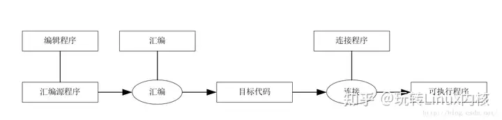
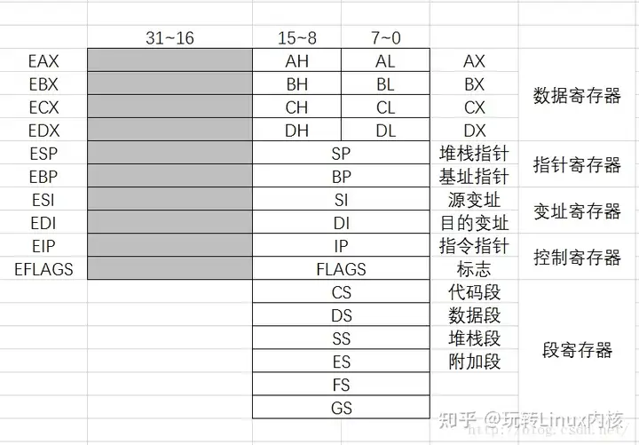
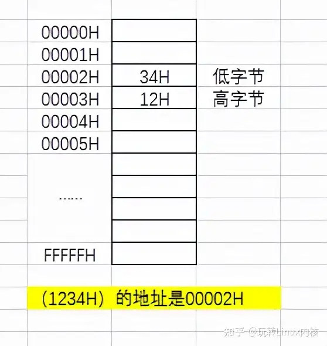
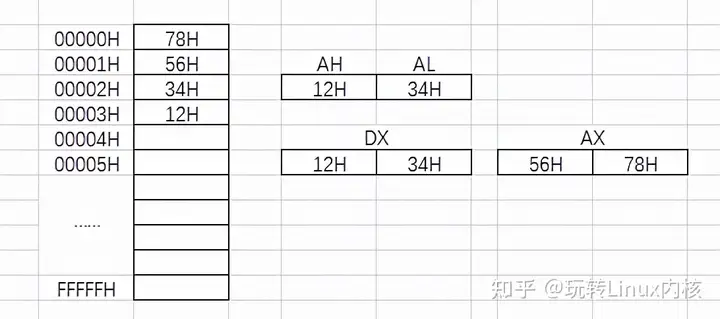
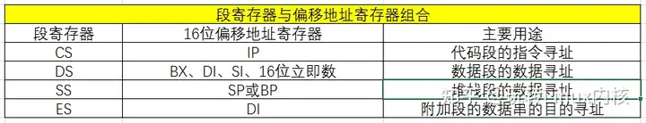
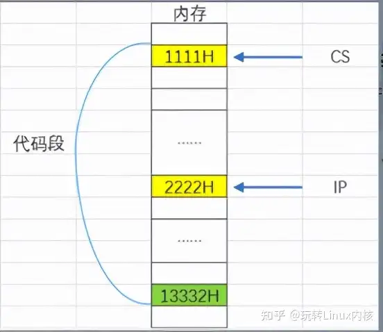
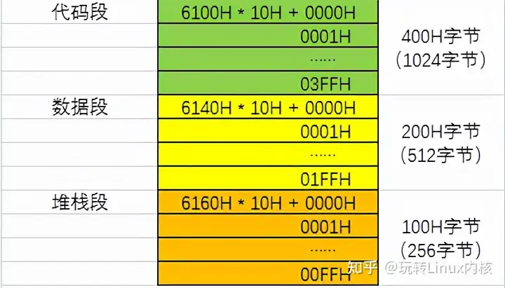

# 09-Linux操作系统汇编语言基础知识

<<<<<<< HEAD


### 1、什么是汇编语言，它在计算机语言中的地位�?

=======
### 1、什么是汇编语言，它在计算机语言中的地位�?
>>>>>>> 0c39c84113bac7dddf3391b0c5409fe6f9bd9d17

```

汇编语言是程序设计语言的基础语言，是唯一可以直接与计算机硬件打交道的语言

```

<<<<<<< HEAD


### 2、汇编语言与源程序、汇编程序、汇编的关系�?


### 3、汇编语言的特�?

=======
### 2、汇编语言与源程序、汇编程序、汇编的关系�?



### 3、汇编语言的特�?
>>>>>>> 0c39c84113bac7dddf3391b0c5409fe6f9bd9d17

* \1) 汇编语言与机器指令一一对应，可充分理解计算机的操作过程汇编语言指令是机器指令的符号表示

* \2) 汇编语言是靠近机器的语言编程时要求熟悉机器硬件系统，可充分利用机器硬件中的全部功能，发挥机器的特点在计算机系统中，某些功能由汇编语言程序实现：实时过程控制系统、系统初始化、实际的输入输出设备操作
<<<<<<< HEAD

* \3) 汇编语言程序的效率高于高级语言效率，指的是用汇编语言编写的源程序在汇编后所得的目标程序效率高时间域的高效率：运行速度快；空间域的高效率：目标代码占用存储空间�?


### 4、汇编语言与高级语言的比�?


### 5、进制转�?


```

（略�?
```


### 6、数据组织单�?


> \1) 位（bit）\

> 是计算机中表示信息的最小单位，符号b，是一个二进制位，每一位用0�?表示\

=======
* \3) 汇编语言程序的效率高于高级语言效率，指的是用汇编语言编写的源程序在汇编后所得的目标程序效率高时间域的高效率：运行速度快；空间域的高效率：目标代码占用存储空间�?

### 4、汇编语言与高级语言的比�?


### 5、进制转�?

```
（略�?
```

### 6、数据组织单�?

> \1) 位（bit）\
> 是计算机中表示信息的最小单位，符号b，是一个二进制位，每一位用0�?表示\
>>>>>>> 0c39c84113bac7dddf3391b0c5409fe6f9bd9d17
> \2) 字节（Byte）\

> 8位二进制数为一个字节\

> \3) 字（Word）\

> 若干个字节为一个字，一般一个字包含两个字节\

> 范围0000H~~FFFFH~~\

> ~~\4) 双字（Double Word）~~\

> ~~两个字节为一个字，四个字节为连个字，称为双字~~\

> ~~范围00000000H~~FFFFFFFFH\

> \5) 字长\

> 机器字的长度为字长，即计算机中每个字所包含的位数，由机器数据总线数决定\
<<<<<<< HEAD

> 例如，数据总线数为64位，机器字长�?4位，即每个字�?个字节\

=======
> 例如，数据总线数为64位，机器字长�?4位，即每个字�?个字节\
>>>>>>> 0c39c84113bac7dddf3391b0c5409fe6f9bd9d17
> \6) 数据字与指令字\

> 数据字：在存储单元中存储的是数据\

> 指令字：在存储单元中存储的是指令\

> 无论是数据字还是指令字，在存储单元中都是以二进制的形式存放的

<<<<<<< HEAD


**7、BCD�?*


两种存储方式：组合型�?个字节表�?个BCD码）；非组合型（1个字节表�?个BCD码）


**8。0X86计算机组织结�?*


微型计算机的硬件系统主要�?个主要部分组成：


* 1\)中央处理器CPU（运算器、控制器、寄存器�?
* 2\)输入输出设备

* 3\)存储�?


**9。0X86 CPU的寄存器**


寄存器分�?类：


=======
\*_7、BCD�?_

两种存储方式：组合型�?个字节表�?个BCD码）；非组合型（1个字节表�?个BCD码）

\*_8�?0X86计算机组织结�?_

微型计算机的硬件系统主要�?个主要部分组成：

* 1\)中央处理器CPU（运算器、控制器、寄存器�?
* 2\)输入输出设备
* 3\)存储�?

**9�?0X86 CPU的寄存器**

寄存器分�?类：

>>>>>>> 0c39c84113bac7dddf3391b0c5409fe6f9bd9d17
* 1\)通用寄存�?
* 2\)控制寄存�?
* 3\)段寄存器

<<<<<<< HEAD


8�?位通用寄存器：AL,AH,BL,BH,CL,CH,DL,DH


8�?6位通用寄存器：AX,BX,CX,DX,SI,DI,BP,SP


8�?2位通用寄存器：EAX,EBX,ECX,EDX,ESI,EDI,EBP,ESP


> 说明�?）指针寄存器（SP,ESP,BP,EBP）\

> SP,ESP为堆栈指针寄存器，存放当前堆栈段栈顶的偏移地址，\

> 是根据指令自动移动的，要想随机读�?
>

> 堆栈段中的数据，必须通过BP或EBP基址指针寄存器来读取。\

> 2）控制寄存器（IP,EIP,FLAGS,EFLAGS）\

> IP,EIP为指令指针寄存器，用于存放当前正在执行的指令的\

> 下一条指令的偏移地址，该寄存器所指的为代码段的偏移地址。\

> FLAGS为标识寄存器，表示程序运行时的状态和一些特殊控�?


3）段寄存�?


代码和数据是分开存放，代码存放在代码段，数据存放在数据段


**10、内存组织结�?*


=======
8�?位通用寄存器：AL,AH,BL,BH,CL,CH,DL,DH

8�?6位通用寄存器：AX,BX,CX,DX,SI,DI,BP,SP

8�?2位通用寄存器：EAX,EBX,ECX,EDX,ESI,EDI,EBP,ESP



> 说明�?）指针寄存器（SP,ESP,BP,EBP）\
> SP,ESP为堆栈指针寄存器，存放当前堆栈段栈顶的偏移地址，\
> 是根据指令自动移动的，要想随机读�?
>
> 堆栈段中的数据，必须通过BP或EBP基址指针寄存器来读取。\
> 2）控制寄存器（IP,EIP,FLAGS,EFLAGS）\
> IP,EIP为指令指针寄存器，用于存放当前正在执行的指令的\
> 下一条指令的偏移地址，该寄存器所指的为代码段的偏移地址。\
> FLAGS为标识寄存器，表示程序运行时的状态和一些特殊控�?

3）段寄存�?

代码和数据是分开存放，代码存放在代码段，数据存放在数据段

\*_10、内存组织结�?_
>>>>>>> 0c39c84113bac7dddf3391b0c5409fe6f9bd9d17

1）内存的地址\

在存储器中内存单元的基本单位&#x662F;_&#x5B57;节_，每个字节都有一个唯一的地址

<<<<<<< HEAD


=======

>>>>>>> 0c39c84113bac7dddf3391b0c5409fe6f9bd9d17

**2）存储单元的内容**


一个存储单元存放的信息为存储单元的内容

<<<<<<< HEAD


1. 分为：字节单元、字节单元、双字单�?
2. 双字：需要两�?6位寄存器，通常为DX:AX,DX高位，AX低位


=======
1. 分为：字节单元、字节单元、双字单�?
2. 双字：需要两�?6位寄存器，通常为DX:AX,DX高位，AX低位


>>>>>>> 0c39c84113bac7dddf3391b0c5409fe6f9bd9d17

```cpp

3)堆栈
<<<<<<< HEAD

堆栈是内存中一块特定的区域，其中数据按�?先进后出*原则

作用：暂存数据、子程序调用与返回、调用中断处理程序、从中断处理程序返回

位置：堆栈段地址存放于SS寄存器中，偏移地址存放在堆栈指针寄存器（SP(16�?/ESP(32�?），

=======
堆栈是内存中一块特定的区域，其中数据按�?先进后出*原则
作用：暂存数据、子程序调用与返回、调用中断处理程序、从中断处理程序返回
位置：堆栈段地址存放于SS寄存器中，偏移地址存放在堆栈指针寄存器（SP(16�?/ESP(32�?），
>>>>>>> 0c39c84113bac7dddf3391b0c5409fe6f9bd9d17
他们永远指向栈顶

	初始化：堆栈的初始化时通过设置SS及SP/ESP值来完成的，可以由编译系统自动完成，也可以在程序

中通过伪指令显示地定义

```


**11、实模式**


```cpp

1)介绍

	

	只有8086/8088工作在实模式下；

	80286以上的微处理器工作在实模式和保护模式下；

	在实模式下微处理器只能寻址1MB的存储空间；
<<<<<<< HEAD

	80286以上系统的微处理器在加点或复位时都以实模式方式开始工�?


2）内存地址的分�?


	*为什么要分段�?

	8086/8088地址总线�?0根，可访问的地址为：2^20=1048576=1M

	8086/8088内部寄存器都�?6位的，可以直接处�?6位长度的存储地址�?6位地址的寻址2^16=64K

	为了把寻址范围扩大�?MB，实模式存储器地址均采用存储空间的分段技术来解决寻址1MB的存储空�?
	提出了段地址和偏移地址合成20位物理地址的概�?
	

	*分段方法�?

	16位段地址+16位段内地址--->20位物理地址

	地址的组合：物理地址=段地址*16D(�?0H)+偏移地址，（段地址*16D--二进制段地址左移4位）

	存放段地址�?6位段地址寄存器（CS、DS、SS、ES�?
	存放偏移地址�?6位指针寄存器（IP、SP�?
	�?MB存储器中可以�?4K个段，每个段最�?4KB，最小为16KB

=======
	80286以上系统的微处理器在加点或复位时都以实模式方式开始工�?

2）内存地址的分�?

	*为什么要分段�?
	8086/8088地址总线�?0根，可访问的地址为：2^20=1048576=1M
	8086/8088内部寄存器都�?6位的，可以直接处�?6位长度的存储地址�?6位地址的寻址2^16=64K
	为了把寻址范围扩大�?MB，实模式存储器地址均采用存储空间的分段技术来解决寻址1MB的存储空�?
	提出了段地址和偏移地址合成20位物理地址的概�?
	
	*分段方法�?
	16位段地址+16位段内地址--->20位物理地址
	地址的组合：物理地址=段地址*16D(�?0H)+偏移地址，（段地址*16D--二进制段地址左移4位）
	存放段地址�?6位段地址寄存器（CS、DS、SS、ES�?
	存放偏移地址�?6位指针寄存器（IP、SP�?
	�?MB存储器中可以�?4K个段，每个段最�?4KB，最小为16KB
>>>>>>> 0c39c84113bac7dddf3391b0c5409fe6f9bd9d17
	


	*物理地址、段地址、段内地址、逻辑地址的区别？*
<<<<<<< HEAD

	物理地址：与内存单元一一对应�?0位二进制�?1MB=00000H~FFFFFH

		    每个物理地址代表一个唯一的内存单�?
	

	段地址：将1MB的内存空间分为长64KB的程序区和数据区称为�?
		  每个段用1�?6位二进制地址表示

		  段地址存放在段寄存器中

=======
	物理地址：与内存单元一一对应�?0位二进制�?1MB=00000H~FFFFFH
		    每个物理地址代表一个唯一的内存单�?
	
	段地址：将1MB的内存空间分为长64KB的程序区和数据区称为�?
		  每个段用1�?6位二进制地址表示
		  段地址存放在段寄存器中
>>>>>>> 0c39c84113bac7dddf3391b0c5409fe6f9bd9d17
		  代码段：用于存放源程序的二进制程序代码，该段的段地址放在CS�?
		  数据段：存放操作数据的，该段的段地址放在DS�?
		  堆栈段：堆栈用的存储区，该段的段地址放在SS�?
		  附加段：该段的段地址放在ES�?
	
<<<<<<< HEAD

	段内地址�?6位二进制段内地址为偏移地址

   （偏移地址）不同段内的偏移地址存放在不同的寄存器中，段寄存器与装偏移地址的寄存器按一定要求组�?
```


=======
	段内地址�?6位二进制段内地址为偏移地址
   （偏移地址）不同段内的偏移地址存放在不同的寄存器中，段寄存器与装偏移地址的寄存器按一定要求组�?
```


>>>>>>> 0c39c84113bac7dddf3391b0c5409fe6f9bd9d17

```cpp

逻辑地址：用段地址和偏移地址来表示内存单元的地址为逻辑地址，例如，段地址：偏移地址

	*逻辑地址与物理地址的换算关系？*
<<<<<<< HEAD

	物理地址 = 段地址*16D�?0H�?偏移地址

	逻辑地址 = 段地址：偏移地址

	例子：逻辑地址�?111H:2222H

物理地址�?111H*10H+2222H = 13332H

假设1111H为代码段地址�?222H在指针寄存器IP中，示意图如下：

```


**内存分配方法�?*


代码段、数据段、堆栈段的大小，是以节为最小单位分配内存区域的16字节=2个字=1节，节的边界地址就是能够�?6整除的地址偏移地址（段内地址）是�?000H开始的例子：假设程序分配的内存区从6100H开始，程序长度1020字节，操作数510字节，堆栈段250字节则代码段长度�?024D=400H，数据段长度�?12D=200H，堆栈段长度�?56D=100H


**示意图如下：**


**段与段之间的关系�?*


8088/8086 CPU�?MB的存储空间划分成若干逻辑段每个段的起始地址必须是能够被16整除的数逻辑段的最大长度为64KB 1MB的存储空间最多可以分�?4K个逻辑段，当每个逻辑段为16KB时段与段之间可以相邻、分离、重叠、部分重�?


**12、保护模�?*


=======
	物理地址 = 段地址*16D�?0H�?偏移地址
	逻辑地址 = 段地址：偏移地址
	例子：逻辑地址�?111H:2222H
物理地址�?111H*10H+2222H = 13332H
假设1111H为代码段地址�?222H在指针寄存器IP中，示意图如下：
```



\*_内存分配方法�?_

代码段、数据段、堆栈段的大小，是以节为最小单位分配内存区域的16字节=2个字=1节，节的边界地址就是能够�?6整除的地址偏移地址（段内地址）是�?000H开始的例子：假设程序分配的内存区从6100H开始，程序长度1020字节，操作数510字节，堆栈段250字节则代码段长度�?024D=400H，数据段长度�?12D=200H，堆栈段长度�?56D=100H

**示意图如下：**



\*_段与段之间的关系�?_

8088/8086 CPU�?MB的存储空间划分成若干逻辑段每个段的起始地址必须是能够被16整除的数逻辑段的最大长度为64KB 1MB的存储空间最多可以分�?4K个逻辑段，当每个逻辑段为16KB时段与段之间可以相邻、分离、重叠、部分重�?

\*_12、保护模�?_
>>>>>>> 0c39c84113bac7dddf3391b0c5409fe6f9bd9d17

```

1）保护模式存储器寻址机制
<<<<<<< HEAD

	在保护模式下，逻辑地址=选择�?偏移地址

	与实模式不同，实模式的段寄存器存放段基地址，而保护模式的段寄存器存放选择�?
	保护模式下，通过选择描述符表中的描述符，间接地形成段基地址

	保护模式的偏移地址最大可以是32位，最大段长可以从16KB扩展�?GB

=======
	在保护模式下，逻辑地址=选择�?偏移地址
	与实模式不同，实模式的段寄存器存放段基地址，而保护模式的段寄存器存放选择�?
	保护模式下，通过选择描述符表中的描述符，间接地形成段基地址
	保护模式的偏移地址最大可以是32位，最大段长可以从16KB扩展�?GB
>>>>>>> 0c39c84113bac7dddf3391b0c5409fe6f9bd9d17
2)描述�?
	描述符包括，段在寄存器中的位置，段的长度，访问权�?
	由基地址、段界限、访问权限、附加字段组�?
		基地址：指定段的起始地址

		段界限：存放该段的最大偏移地址
<<<<<<< HEAD

=======
>>>>>>> 0c39c84113bac7dddf3391b0c5409fe6f9bd9d17
		访问权限：说明该段在系统中的功能和一些控制信�?
		附加字段：描述该段的一些属�?
	描述符的内容是由系统自动设置�?
	由于段寄存器�?6位的，描述符�?4位的
<<<<<<< HEAD

	故将64位的段描述符放按顺序存放形成一个段描述符表，放在内存中

=======
	故将64位的段描述符放按顺序存放形成一个段描述符表，放在内存中
>>>>>>> 0c39c84113bac7dddf3391b0c5409fe6f9bd9d17
	而在段寄存器中实际存放的是要选择的段描述符表的序号，类似于数组中的下�?
```


**13、存储器管理机制**


```cpp
<<<<<<< HEAD

=======
>>>>>>> 0c39c84113bac7dddf3391b0c5409fe6f9bd9d17
1）分段管理机�?
		①虚拟存储器：在有限的物理存储器上获取更大的使用空间

			*虚拟存储器是如何实现存储的？*
<<<<<<< HEAD

=======
>>>>>>> 0c39c84113bac7dddf3391b0c5409fe6f9bd9d17
			在程序执行期间的任意时刻，虚拟存储器系统自动吧程序分成许多小块即程序�?
			将某个程序段存放到物理存储器中，其他程序段放在磁盘中

			当程序要访问到哪个程序段时，就把哪个程序段引导到物理存储器中

		
<<<<<<< HEAD

		②分段管理：�?GB的存储空间分成若干独立的受保护的存储空间�?
			每个应用程序可以使用这些存储空间�?
	

=======
		②分段管理：�?GB的存储空间分成若干独立的受保护的存储空间�?
			每个应用程序可以使用这些存储空间�?
	
>>>>>>> 0c39c84113bac7dddf3391b0c5409fe6f9bd9d17
	2）分页管理机�?
①线性地址空间：每个进程都有相同大小的4GB线性空�?
用分段管理机制实现虚拟地址空间到线性地址空间的映射，实现把二维的

虚拟地址转换为一维的线性地址


②分页存储管理：把线性地址空间和物理地址空间分别划分为大小相同的块，每块长为4KB
<<<<<<< HEAD

=======
>>>>>>> 0c39c84113bac7dddf3391b0c5409fe6f9bd9d17
这样的块称为页，通过分页管理机制实现线性地址空间到物理地址空间�?
映射，实现线性地址到物理地址的转�?
```


***


版权声明：本文为知乎博主「玩转Linux内核」的原创文章，遵循CC 4.0 BY-SA版权协议，转载请附上原文出处链接及本声明。\

原文链接：https://zhuanlan.zhihu.com/p/449157752


## 编程基本功实践

> 汇编是"看透 C 到底干了什么"的显微镜，也是读内核启动/上下文切换代码的必备语言。

### 关联知识点

| 本章概念 | 对应的编程基本功 | 说明 |
| --- | --- | --- |
| GNU 汇编语法、段(.text/.data/.bss)、标号 | [C 语言与系统编程：编译链接](../bian-cheng-ji-ben-gong/02-c-yu-yan-yu-xi-tong-bian-cheng-ji-ben-gong.md) | 汇编与 C 链接成同一份产物 |
| AT&T vs Intel 语法差异 | [工具链与调试：objdump/gcc -S](../bian-cheng-ji-ben-gong/04-gong-ju-lian-yu-diao-shi-ji-ben-gong.md) | 操作数左右顺序相反 |
| 伪指令 .global/.section/.align | [工具链与调试：Makefile/链接脚本](../bian-cheng-ji-ben-gong/04-gong-ju-lian-yu-diao-shi-ji-ben-gong.md) | 控制符号可见性与对齐 |
| 调用约定（谁传参、谁清栈） | [计算机系统基础：栈与调用栈](../bian-cheng-ji-ben-gong/05-ji-suan-ji-xi-tong-ji-chu-ji-ben-gong.md) | 函数调用背后的栈帧 |

### 动手实验：写一段汇编做加法，从 C 调用

```c
/*  caller.c  */
extern int add_asm(int a, int b);
#include <stdio.h>
int main(void){ printf("3+4=%d\n", add_asm(3,4)); }
```
```asm
/*  add.s  (x86-64, AT&T 语法) */
.global add_asm
add_asm:
    mov %edi, %eax     /* 第1个参数 -> eax */
    add %esi, %eax     /* 加第2个参数 */
    ret
```

编译：gcc caller.c add.s -o t && ./t 输出 3+4=7。要点：C 调用约定规定参数放 %edi/%esi，汇编遵守它才能被 C 调用。

### 常见陷阱

1. **混淆 AT&T 与 Intel 语法** —— mov %eax,%ebx（AT&T，源在右）vs mov ebx,eax（Intel，源在左）。
2. **忘记对齐** —— 某些指令/数据结构要求地址对齐，否则性能下降甚至崩溃。
3. **不理解调用约定** —— 自己写的汇编若不按约定用寄存器/栈，返回后调用方数据全乱。

### 自测题

1. AT&T 语法里 mov %eax,%ebx 是把哪个值移到哪个寄存器？
2. .text / .data / .bss 三段分别放什么？
3. 为什么 C 能直接调用你写的汇编函数（符号是怎么对上的）？
4. 用 gcc -S 看一个 C 函数，能不能找到它对应的汇编？
