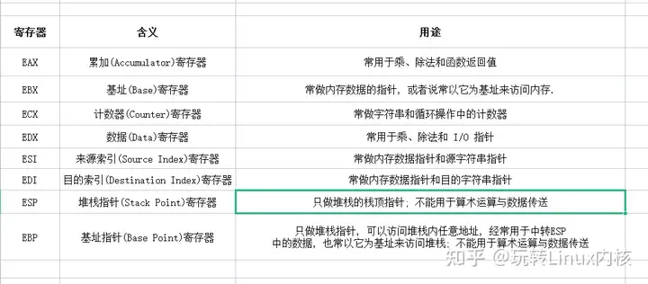
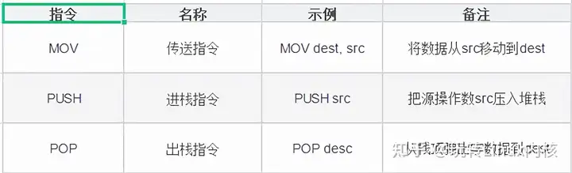
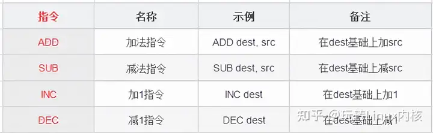
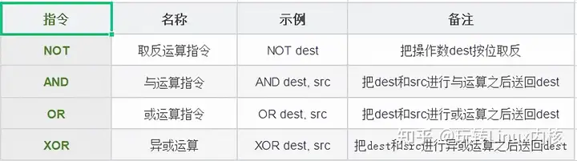
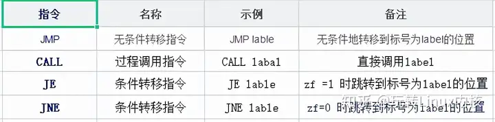
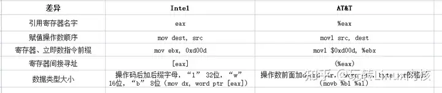

# 10-Linux操作系统汇编指令入门级整理知识点


### 前言

<<<<<<< HEAD


我们大都是被高级语言惯坏了的一代，源源不断的新特性正在逐步添加到各类高级语言之中，汇编作为最接近机器指令的低级语言，已经很少被直接拿来写程序了，不过我还真的遇到了一个，那是之前的一个同事，因为在写代码时遇到了成员函数权限及可见性的问题，导致他无法正确调用想执行的函数，结果他就开始在 C++ 代码里嵌入汇编了，绕过了种种限制终于如愿以偿，但是读代码的时候我们傻眼了。


因为项目是跨平台的，代码推送的 Linux 编译的时候他才发现，汇编代码的语法在 Linux 和 Windows 上居然是不一样的，结果他又用一个判断平台的宏定义“完美”地解决了，最终这些代码肯定是重写了啊，因为可读性太差了，最近在学习左值、右值、左引用和右引用的时候，总是有人用程序编译生成的中间汇编代码来解释问题，看得我迷迷糊糊，所以决定熟悉一下简单的汇编指令，边学习边记录，方便今后忘记了可以直接拿来复习。

=======
我们大都是被高级语言惯坏了的一代，源源不断的新特性正在逐步添加到各类高级语言之中，汇编作为最接近机器指令的低级语言，已经很少被直接拿来写程序了，不过我还真的遇到了一个，那是之前的一个同事，因为在写代码时遇到了成员函数权限及可见性的问题，导致他无法正确调用想执行的函数，结果他就开始在 C++ 代码里嵌入汇编了，绕过了种种限制终于如愿以偿，但是读代码的时候我们傻眼了�?

因为项目是跨平台的，代码推送的 Linux 编译的时候他才发现，汇编代码的语法在 Linux �?Windows 上居然是不一样的，结果他又用一个判断平台的宏定义“完美”地解决了，最终这些代码肯定是重写了啊，因为可读性太差了，最近在学习左值、右值、左引用和右引用的时候，总是有人用程序编译生成的中间汇编代码来解释问题，看得我迷迷糊糊，所以决定熟悉一下简单的汇编指令，边学习边记录，方便今后忘记了可以直接拿来复习�?
>>>>>>> 0c39c84113bac7dddf3391b0c5409fe6f9bd9d17

### 什么是汇编语言


汇编语言是最接近机器语言的编程语言，引用百科中的一段话解释为：

<<<<<<< HEAD


汇编语言（assembly language）是一种用于电子计算机、微处理器、微控制器或其他可编程器件的低级语言，亦称为符号语言。在汇编语言中，用助记符代替机器指令的操作码，用地址符号或标号代替指令或操作数的地址。汇编语言又被称为第二代计算机语言。


### 汇编语言产生的原因


对于绝大多数人来说，二进制程序是不可读的，当然有人可以读，比如第一代程序员，但这类人快灭绝了，直接看二进制不容易看出来究竟做了什么事情，比如最简单的加法指令二进制表示为 00000011，如果它混在一大串01字符串中就很难把它找出来，所以汇编语言主要就是为了解决二进制编码的可读性问题。


### 汇编与二进制的关系


换句话来说，汇编语言就是把给机器看的二进制编码翻译成人话，汇编指令是机器指令的助记符，与机器指令是一一对应的关系，是一种便于阅读和记忆的书写格式。有效地解决了机器指令编写程序难度大的问题，并且使用编译器，可以很方便地把汇编程序转译成机器指令程序，比如之前提到的 00000011 加法指令，对应的汇编指令是 ADD，在调用汇编器时就会将 ADD 翻译成00000011。


### 寄存器


说到汇编指令不得不提到寄存器，寄存器本身是用来存数据的，因为 CPU 本身只负责逻辑运算，数据需要单独储存在其他的地方，但是对于不熟悉寄存器的人来说会有疑惑，数据不是存在硬盘上吗？或者说数据不是存在内存中吗？这些想法都没错，那么寄存器是用来做什么的呢？


### 寄存器作�?


其实硬盘、内存都是用来存储数据的，但由于 CPU 的运算速度远高于内存的读写速度，更不用说从硬盘上取数据了，所以为了避免被拖慢速度影响效率，CPU 都自带一级缓存和二级缓存，一些 CPU 甚至增加了三级缓存，从这些缓存中读写数据要比内存快很多，但是还是无法使用飞速运转的 CPU，所以才会有寄存器的存在。


寄存器不是后来增加的，在最初的计算中就已经设计出来，相比而言，多级缓存出现得更晚一些，通常那些最频繁读写的数据都会被放在寄存器里面，CPU 优先读写寄存器，再通过寄存器、缓存跟内存来交换数据，达到缓冲的目的，因为可以通过名称访问寄存器，这样访问速度是最快的，因此也被称为零级缓存。


### 存取速度比较


通过上面的叙述我们可以知道存取速度从高到低分别�? 寄存器> 1级缓�?> 2级缓�?> 3级缓�?> 内存 > 硬盘，关于它们的存取速度，举个例子很容易就能明白了，比如我们做菜（CPU工作）时，取手中（寄存器）正拿着的肉和蔬菜肯定是最快的，如果没有就需要把案板上（1级缓存）处理好的菜拿过来，如果案板上没有就在更远一点的洗菜池（2级缓存）中找一找，还没找到的话就要到冰箱（3级缓存）中看一看了，这时发现家里真没有，那去楼下的菜店（内存）去买点吧，转了一圈发现没有想要的，最后还是开车去农贸市场（硬盘）买吧。


通过上面这个例子应该能明白它们的速度关系了，既然缓存这么快，为什么不用缓存代替内存，或者将2。级缓存都换成1级缓存呢？这里边有一个成本问题，速度越快对应着价格越高，如果你买过机械硬盘和固态硬盘应该很容易就理解了。


**寄存器分类*


常用的 x86 CPU 寄存器有8个：EAX 、EBX、ECX、EDX、EDI、ESI、EBP、ESP，据说现在寄存器总数已经超过100个了，等我找到相关资料再来补充，上面这几个寄存器是最常用的，这些名字也常常出现在汇编的代码中。


我们常说的32位、64CPU 是指数据总线的宽度或根数，而寄存器是暂存数据和中间结果的单元，因此寄存器的位数也就是处理数据的长度与数据总线的根数是相同的，所以32CPU 对应的寄存器也应该是32位的。


**常用寄存器用途*


上面提到每个寄存器都有其特定的用途，我们以32CPU 为例简单说明下这些寄存器的作用，整理如下表所示


### 寄存器EAX、AX、AH、AL的关系


在上面的图标中每个常用寄存器后面还有其他的名字，它们是同一个寄存器不同用法下的不同名字，比如在32位 CPU 上，EAX是32位的寄存器，而AX是EAX的低16位，AH是AX的高8位，而AL是AX的低8位，它们的对照关系如下


=======
汇编语言（assembly language）是一种用于电子计算机、微处理器、微控制器或其他可编程器件的低级语言，亦称为符号语言。在汇编语言中，用助记符代替机器指令的操作码，用地址符号或标号代替指令或操作数的地址。汇编语言又被称为第二代计算机语言�?

### 汇编语言产生的原�?

对于绝大多数人来说，二进制程序是不可读的，当然有人可以读，比如第一代程序员，但这类人快灭绝了，直接看二进制不容易看出来究竟做了什么事情，比如最简单的加法指令二进制表示为 00000011，如果它混在一大串01字符串中就很难把它找出来，所以汇编语言主要就是为了解决二进制编码的可读性问题�?

### 汇编与二进制的关�?

换句话来说，汇编语言就是把给机器看的二进制编码翻译成人话，汇编指令是机器指令的助记符，与机器指令是一一对应的关系，是一种便于阅读和记忆的书写格式。有效地解决了机器指令编写程序难度大的问题，并且使用编译器，可以很方便地把汇编程序转译成机器指令程序，比如之前提到的 00000011 加法指令，对应的汇编指令�?ADD，在调用汇编器时就会�?ADD 翻译�?00000011�?

### 寄存�?

说到汇编指令不得不提到寄存器，寄存器本身是用来存数据的，因为 CPU 本身只负责逻辑运算，数据需要单独储存在其他的地方，但是对于不熟悉寄存器的人来说会有疑惑，数据不是存在硬盘上吗？或者说数据不是存在内存中吗？这些想法都没错，那么寄存器是用来做什么的呢？

### 寄存器作�?

其实硬盘、内存都是用来存储数据的，但�?CPU 的运算速度远高于内存的读写速度，更不用说从硬盘上取数据了，所以为了避免被拖慢速度影响效率，CPU 都自带一级缓存和二级缓存，一�?CPU 甚至增加了三级缓存，从这些缓存中读写数据要比内存快很多，但是还是无法使用飞速运转的 CPU，所以才会有寄存器的存在�?

寄存器不是后来增加的，在最初的计算中就已经设计出来，相比而言，多级缓存出现得更晚一些，通常那些最频繁读写的数据都会被放在寄存器里面，CPU 优先读写寄存器，再通过寄存器、缓存跟内存来交换数据，达到缓冲的目的，因为可以通过名称访问寄存器，这样访问速度是最快的，因此也被称为零级缓存�?

### 存取速度比较

通过上面的叙述我们可以知道存取速度从高到低分别�? 寄存�?> 1级缓�?> 2级缓�?> 3级缓�?> 内存 > 硬盘，关于它们的存取速度，举个例子很容易就能明白了，比如我们做菜（CPU工作）时，取手中（寄存器）正拿着的肉和蔬菜肯定是最快的，如果没有就需要把案板上（1级缓存）处理好的菜拿过来，如果案板上没有就在更远一点的洗菜池（2级缓存）中找一找，还没找到的话就要到冰箱（3级缓存）中看一看了，这时发现家里真没有，那去楼下的菜店（内存）去买点吧，转了一圈发现没有想要的，最后还是开车去农贸市场（硬盘）买吧�?

通过上面这个例子应该能明白它们的速度关系了，既然缓存这么快，为什么不用缓存代替内存，或者将2�?级缓存都换成1级缓存呢？这里边有一个成本问题，速度越快对应着价格越高，如果你买过机械硬盘和固态硬盘应该很容易就理解了�?

\*_寄存器分�?_

常用�?x86 CPU 寄存器有8个：EAX 、EBX、ECX、EDX、EDI、ESI、EBP、ESP，据说现在寄存器总数已经超过100个了，等我找到相关资料再来补充，上面这几个寄存器是最常用的，这些名字也常常出现在汇编的代码中�?

我们常说�?2位�?4�?CPU 是指数据总线的宽度或根数，而寄存器是暂存数据和中间结果的单元，因此寄存器的位数也就是处理数据的长度与数据总线的根数是相同的，所�?2�?CPU 对应的寄存器也应该是32位的�?

\*_常用寄存器用�?_

上面提到�?个寄存器都有其特定的用途，我们�?2�?CPU 为例简单说明下这些寄存器的作用，整理如下表�?



### 寄存器EAX、AX、AH、AL的关�?

在上面的图标中每个常用寄存器后面还有其他的名字，它们是同一个寄存器不同用法下的不同名字，比如在32�?CPU 上，EAX�?2位的寄存器，而AX是EAX的低16位，AH是AX的高8位，而AL是AX的低8位，它们的对照关系如�?
>>>>>>> 0c39c84113bac7dddf3391b0c5409fe6f9bd9d17

```

00000000 00000000 00000000 00000000
<<<<<<< HEAD

|===============EAX===============|---4个字节
                  |======AX=======|---2个字节
                  |==AH===|-----------1个字节
                          |===AL==|---1个字节
=======
|===============EAX===============|---4个字�?
                  |======AX=======|---2个字�?
                  |==AH===|-----------1个字�?
                          |===AL==|---1个字�?
>>>>>>> 0c39c84113bac7dddf3391b0c5409fe6f9bd9d17
```


### 汇编语言指令

<<<<<<< HEAD


终于说到汇编常用指令了，因为 linux 和 windows 下面的汇编语法是有些不同的，所以下面我们先通过 windows 下的汇编指令来简单学习一下，后续再来比较两者的不同。


**数据传送指令*


**算术运算指令**


**逻辑运算指令**


**循环控制指令**


**循环控制指令**


**linux 和 windows 下汇编的区别**


前面说到 linux 和 windows 下面的汇编语法是不同的，其实两种语法的不同和系统不同没有绝对的关系，一般在 linux 上会使用 gcc/g++ 编译器，而在 windows 上会使用微软的 cl 也就是MSBUILD，所以产生不同的代码是因为编译器不同，gcc 下采用的是AT\&T的汇编语法格式，MSBUILD 采用的是Intel汇编语法格式。


**总结**


* 汇编指令是机器指令的助记符，与机器指令是一一对应的
* AT\&T的汇编语法格式和Intel汇编语法格式的是不同的
* 常用寄存器：EAX 、EBX、ECX、EDX、EDI、ESI、EBP、ESP

* 存取速度从高到低分别�? 寄存器> 1级缓�?> 2级缓�?> 3级缓�?> 内存 > 硬盘

=======
终于说到汇编常用指令了，因为 linux �?windows 下面的汇编语法是有些不同的，所以下面我们先通过 windows 下的汇编指令来简单学习一下，后续再来比较两者的不同�?

\*_数据传送指�?_



**算术运算指令**



**逻辑运算指令**



**循环控制指令**


**循环控制指令**



**linux �?windows 下汇编的区别**

前面说到 linux �?windows 下面的汇编语法是不同的，其实两种语法的不同和系统不同没有绝对的关系，一般在 linux 上会使用 gcc/g++ 编译器，而在 windows 上会使用微软�?cl 也就�?MSBUILD，所以产生不同的代码是因为编译器不同，gcc 下采用的是AT\&T的汇编语法格式，MSBUILD 采用的是Intel汇编语法格式�?



**总结**

* 汇编指令是机器指令的助记符，与机器指令是一一对应�?
* AT\&T的汇编语法格式和Intel汇编语法格式的是不同�?
* 常用寄存器：EAX 、EBX、ECX、EDX、EDI、ESI、EBP、ESP
* 存取速度从高到低分别�? 寄存�?> 1级缓�?> 2级缓�?> 3级缓�?> 内存 > 硬盘
>>>>>>> 0c39c84113bac7dddf3391b0c5409fe6f9bd9d17
* 常用的汇编指令：mov、je、jmp、call、add、sub、inc、dec、and、or


***


版权声明：本文为知乎博主「玩转Linux内核」的原创文章，遵循CC 4.0 BY-SA版权协议，转载请附上原文出处链接及本声明。\

原文链接：https://zhuanlan.zhihu.com/p/449787476


## 编程基本功实践

> 汇编指令是"位运算 / 算术 / 分支"在硬件上的直接映射，和 C 表达式一一对应。

### 关联知识点

| 本章概念 | 对应的编程基本功 | 说明 |
| --- | --- | --- |
| ldr/str 对应 C 的取/存变量（含指针解引用） | [C 语言：指针与数组](../bian-cheng-ji-ben-gong/02-c-yu-yan-yu-xi-tong-bian-cheng-ji-ben-gong.md) | p->x 编译后常是 ldr |
| 移位 lsl/lsr 对应 << / >> | [C 语言：位运算](../bian-cheng-ji-ben-gong/02-c-yu-yan-yu-xi-tong-bian-cheng-ji-ben-gong.md) | 乘除以 2 的幂用移位 |
| 逻辑 and/orr/eor 对应 & / | / ^ | [C 语言：位运算](../bian-cheng-ji-ben-gong/02-c-yu-yan-yu-xi-tong-bian-cheng-ji-ben-gong.md) | 清位/置位/取反 |
| cmp + b 条件跳转对应 if/else、for | [计算机系统基础：程序执行模型](../bian-cheng-ji-ben-gong/05-ji-suan-ji-xi-tong-ji-chu-ji-ben-gong.md) | 高级控制流落到比较+跳转 |

### 动手实验：用 ARM 汇编实现 a = b*4 + c（移位 + 加法）

```asm
/*  ARM 语法示意 */
.global calc
calc:
    lsl  r0, r1, #2     /* r0 = b << 2  ==> b*4 */
    add  r0, r0, r2     /* r0 = r0 + c */
    bx   lr             /* 返回 */
```

要点：C 里的 b*4 在不开优化时也会被编译器翻译成一条移位指令——这就是位运算基本功的价值，比乘法更快。

### 常见陷阱

1. **混淆 ldr 与 mov** —— mov 搬寄存器间的值，ldr 从内存加载；指针解引用必用 ldr。
2. **忘记 ARM 的条件执行** —— 同一条指令可带 eq/ne/... 后缀，减少分支，别套用 x86 思维。
3. **移位溢出** —— 移出的高位直接丢弃，等价于对位数取模，不是自动扩宽。

### 自测题

1. C 里的 p->field 通常会编译成哪类汇编指令？为什么？
2. x * 8 用移位怎么写？为什么移位比乘法快？
3. a &= ~(1<<3) 这句 C，对应哪些汇编逻辑指令（清某一位）？
4. ARM 的 cmp + bne 对应 C 里的什么结构？
